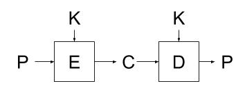
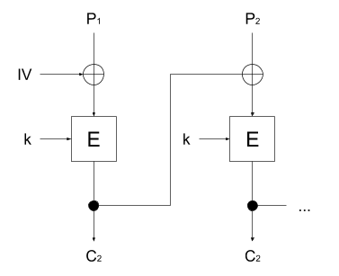
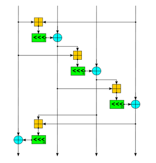
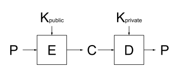
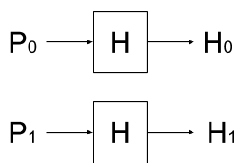
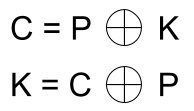



<!-- 
DONT FORGET ABOUT HTML IN MARKDOWN YOU DOOF
-->

# Cryptography and Cryptanalyis: Attacking Cryptographic Systems

**Sylvan Bowdler** - Published: **{{ pubDate }}**

## 1.0 Introduction 
The recent discovery of another vulnerability in the SHA-1 hashing algorithm being discovered recently *(Leurent and Peyrin, 2020)*, impacting on technologies such as PGP/GnuPG and X.509 certificates and by association impacting common technologies used within the modern internet to provide secure communications such as SSH and TLS, highlights the effects of cryptanalysis in modern software development. This report aims to cover the types of vulnerabilities in modern cryptographic systems by giving examples of modern encryption ciphers, common attacks used against modern ciphers, and how these attacks are impacting modern information systems.

## 2.0 Cryptography in Modern Software Development
There are three main types of ciphers used in modern cryptographic systems. First being the symmetric ciphers - block and stream ciphers - which depend on a single secret key. Second being the asymmetric ciphers which depend on a public and private key. This section will discuss the structure of these ciphers and modern implementations of these ciphers. 

### 2.1 Block Ciphers (AES)
A block cipher is commonly used across many modern encryption implementations such as AES/DES. It takes a fixed-length block of bytes and outputs the encrypted bytes. The encrypted bytes are determined by the key by using a process called ‘keyed permutation’. Every possible plaintext block input is mapped to another input to generate a set of outputs for any given inputs. This works as an encryption algorithm, as given any pair of input plaintext and output cipher cannot be determined without the presence of the key.

The above figure shows that a single encryption block when given a plaintext and key outputs the associated ciphertext. And that the decryption block when given the generated ciphertext and the same key generates the same plaintext.  (Crypto101, 2019, p. 31)

| Block Input | Related Output |
| ----------- | -------------- |
| 00          | 11             |
| 01          | 01             |
| 10          | 00             |
| 11          | 10             |

The above table also demonstrates an example of the mapping between a block input to the related output - using within keyed permutation. 

AES (Advanced Encryption Standard) is among the most popular implementation of a block cipher encryption algorithm, announced in 2001 by NIST (National Institute of Standards and Technology) *(Dworkin et al, 2001)* and went on to be used by the US government and the National Security agency, as shown from the following excerpt from a CNSS (Committee on National Security Systems) Policy.

> *“The design and strength of all key lengths of the AES algorithm (i.e., 128, 192 and 256) are sufficient to protect classified information up to the SECRET level.  TOP SECRET information will require [the] use of either the 192 or 256 lengths.  The implementation of AES in products intended to protect national security systems and/or information must  reviewed and certified by NSA prior to their acquisition and use.” (CNSS, 2003)*

The adoption of AES by these major government agencies to handle their critical information showcases the security of AES as an encryption. This is again supported by no practical breaks being discovered since it’s release. One major instance of AES being broken was in 2011 by Bogdanov, Khovratovich and Rechberger and demonstrated a key recovery attack on AES-128/192/256, however due to the computational requirements of this attack it has no practical effects on modern AES usages as Bogdanov has mentioned that *“on a trillion machines, that each could test a billion keys per second, it would take more than two billion years to recover an AES-128 key” (Neal, 2011)*.

### 2.2 Stream Ciphers (Salsa20/ChaCha) 
<!-- Elaborate on some of these terms at some point? -->
A second family of ciphers is the stream cipher. Stream ciphers utilise a block cipher in a specific  ‘Mode of Operation’ (MoO) called ‘Cipher Block Chaining’ (CBC) which removes a possible attack vector in the ‘Electronic Cook Book’ (ECB) MoO in which an attacker would be able to determine a secret suffix value using an oracle attack (Crypto101, 2019 p. 50-53). As shown by the below diagram, the CBC mode requires an additional initialisation vector (IV) in order to operate, this value must be generated from a cryptographically secure random source, but has no secrecy requirement. 

*The previous figure shows an example of how encryption blocks can be chained to generate a ciphertext (Crypto101, 2019, p. 54).*

A modern stream cipher is Salsa20 and the closely related ChaCha cipher, both created by Daniel Bernstein. It revolves around a quarter round function (see following image) applied to the state matrix created from a 64-byte block, repeated for a given amount of rounds - by default most implementations use 20 rounds. Bernstein claims that *“Salsa20 is consistently faster than AES"* and that *“the community seems to have rapidly gained confidence in the security of the cipher” (Bernstein, 2011)*. The security of the cipher as also been enforced by a proof that demonstrated that a differential cryptanalysis of Salsa20 with 15 rounds is less practical than a full 128-bit key brute-force (Mouha and Preneel, 2013).

*An example quarter round function used within Salsa20 - using a mixture of addition, rotation and XOR operations. (Wikipedia, 2018)*

### 2.3 Public Key Encryption
Public key encryption, also known as asymmetric encryption, is built around the requirement that one party wants to be able to receive messages from other parties that can only be read by themselves. This has substantial advantages over symmetric encryption when there is a requirement of communications over insecure or untrusted mediums, as it does not require the exchange of a secret key over possibly insecure mediums.

*Structure of Public Key Encryption - note that the encryption and decryption function use different keys.*

The most popular asymmetric encryption algorithm is the RSA system, named after Ron Rivest, Adi Shamir, and Leonard Adleman who designed the algorithm in 1977 *(Rivest, Shamir and Adleman, 1977)*, which is built around the difficulty of factoring two large prime numbers. RSA has become one of the leading public key encryption algorithms, commonly used within OpenSSL to provide a method of secure key exchange.

### 2.4 Cryptographic Hashing
While not a type of encryption cipher, hashing algorithms play an important part in modern software development alongside encryption ciphers, being the main secure method of verifying the contents of data - such as user passwords. Cryptographic hashing algorithms take a given input and produce a one-to-one mapping to an output value. 

*Two different plaintexts - two different hashes. The basis of hashing functions.*

As such, given two plaintexts with only 1 bit difference between them, a hashing function would produce a unique output for each value. This is invaluable when wanting to verify a given password without the requirement of storing a users password in a system in plaintext. The weakness within hashing algorithms is that once a collision (two inputs that produce the same output) has been found, the integrity of the algorithm is heavily reduced, as shown recently by the discovery of a new collision in SHA-1 *(Leurent and Peyrin, 2020)* further degrading SHA-1’s suitability as a trustworthy hashing algorithm.

## 3.0 Common Cryptographic Attacks
After discussing the types of ciphers used in modern software development, this section aims to discuss how cryptanalysis attacks these cryptographic systems to achieve a given goal. Examples of common goals of cryptographic Attacks  are as follow *(CAPEC, 2019)*:

1. “Total Break” - Discovering the secret key.
2. “Global Deduction” - Finding a functionally equivalent algorithm that does not require knowledge of  the secret key
3. “Information Deduction” - Gaining information about plaintexts or ciphertexts that was not previously known.
4. “Distinguishing Algorithm”  - Being able to distinguish the ciphertext from a random permutation of bits.

### 3.1 Brute-force Attacks
Given a cryptographic system, there is always the possibility of an attacker brute-forcing the system. In modern software development, this is an issue especially when concerning cryptographic hashing algorithms which are commonly used to store user passwords. If using a hashing algorithm with a fast hashing speed, it reduces the time investment required to brute-force a given hash when combined with tools such as rainbow tables - precomputed hashes for entire keyspaces and plaintext lengths - it greatly reduces the time requirement of attempting bruce-forcing attacks in real-world adversary situations. However, this largely affects only hashing algorithms, and encryption algorithms are less commonly able to be brute forced as the key size can greatly increase the amount of computation required. As for any given key of N bits, the number of keys is 2^N - for example, AES with a key size of 128 bits would have 3.4 x 10^38 ~ keys.

### 3.2 Known Plaintext Attacks
Known plaintext attacks assume that the attacker has access to pairs of plaintext and their associated ciphertexts. Using this information the attacker is able to determine the relationships between the pairs to determine the key used to encrypt a given pair. A simple example of a known plaintext attack would be a simple XOR encryption algorithm. Given that an attacker knows the pairs they would be able to easily derive the key shown by the process in the following image. This was an attack method used during World War 2, where analysts had access to ciphertexts generated from the Enigma machine, alongside captured or stolen ‘cribs’ - plaintext messages *(Carter, n.d)*.

*Example of a basic known plaintext attack, involving the unknown key, K, within a basic XOR encryption.*

### 3.3 Side-Channel Attacks 
While side-channel attacks target the implementation of cryptographic systems instead of the cryptographic system themselves, they are becoming more widely seen, with the most noteworthy recently being that of the Meltdown and Spectre attacks on modern CPU platforms which caused not only secrets to be leaked but, in the case of Meltdown, would allow *“an adversary to read memory of other processes or virtual machines in the cloud without any permissions or privileges” (Lipp, et al,  2018, p1)* by exploiting the architecture of the CPU’s and their use of Out-of-Order Execution. This is significant, as instead of traditional cryptanalysis that analyses the cryptographic algorithms, it has pivoted the attack to the implementation, to find oversights in hardware or software that allow an attacker to extract secrets from a theoretically secure system.

## 4.0 The Real-World Application of Cryptographic Vulnerabilities
This section aims to demonstrate the real-world effects of vulnerabilities in cryptographic systems, and how attacking these systems can cause real-world damage to users by discussing several vulnerabilities demonstrated in real-world systems.

### 4.1 SHA-1 Chosen Prefix Collision
The recently released SHA-1 chosen prefix collision by *Leurent and Peyrin (2020)* demonstrates the increasing ease of calculating collisions within weak cryptographic hashing algorithms. The aim of the researchers was to build upon the first full collision within SHA-1 by *Stevens et al (2017)* by demonstrating a more complex attack where they generate a collision for the following scenario: 
    
>*“two message prefixes P and P′ are first given as a challenge to the adversary, and his goal is to compute two messages M and M′ such that H(P ‖ M) = H( P′ ‖ M′)”*

This attack is more complex, as the requirement of calculating a collision with a provided prefix increases the complexity of the attacks as the prefix creates random and *“completely uncontrolled internal differences”* in the algorithms state. While the attack was complex, the time requirement was reduced by renting GPU farms to gain a large amount of computing power, with the final output of the paper being a pair of PGP public keys with colliding signatures allowing the following situation to occur: 
    
>*“... key B is a legitimate key for Bob (to be signed by the Web of Trust), but the signature can be transferred to key A which is a forged key with Alice’s ID. The signature will still be valid because of the collision, but Bob controls key A with the name of Alice, and signed by a third party. Therefore, he can impersonate Alice and sign any document in her name.”*

This means, when applied to real-world keys using SHA-1 such as GnuPG, an attacker would be able to impersonate another user, perhaps to gain confidential knowledge or access to a business’s assets.

### 4.2 Meltdown Side-channel Attack
The Meltdown Side-channel attack on modern CPU architecture was announced in 2018 by Lipp et al, and demonstrated the catastrophic impact that side-channel attacks can have on the security guarantees made by hardware manufacturers. The main attack involves taking advantage of a CPU cache side-channel attack and allows an adversary to exfiltrate the entire kernel memory utilising this attack. As such:

>*“Meltdown allows an unprivileged process to read data mapped in the kernel address space, including the entire physical memory on Linux and OS X, and a large fraction of the physical memory on Windows.” (Lipp et al, 2018)*

This vulnerability demonstrates the importance of security-aware development at all levels of computing, as one link in the chain demonstrating a weakness can cause the entire chain of trust to fail. The paper later demonstrates that utilising the Meltdown attack they were able to dump the memory of a Firefox 56 instance and manage to exfiltrate the plaintext passwords stored in it’s password manager further demonstrating the practical security impacts of a side-channel attack of this scale.

# Bibliography 
Bernstein, D. (2008) ChaCha, a variant of Salsa20, [online]. [Accessed 9 January 2020]. Available at: <https://cr.yp.to/chacha.html#chacha-paper>

Bhargavan, K. and Leurent G. (2016) Sweet32: Birthday attacks on 64-bit block ciphers in TLS and OpenVPN, [online]. [Accessed 9 January 2020]. Available at: <https://sweet32.info/>

Biryukov A., De Cannière C. (2011) Linear Cryptanalysis for Block Ciphers. In: van Tilborg H.C.A., Jajodia S. (eds) Encyclopedia of Cryptography and Security. Springer, Boston, MA

Bogdanov, A., Khovratovich, D., and Rechberger, C,. (2011) Biclique cryptanalysis of the full AES. [online]. [Accessed 10 January 2020] Available at: <http://research.microsoft.com/en-us/projects/cryptanalysis/aes.aspx>

CAPEC, (2019) CAPEC-97: Cryptanalysis. [online]. [Accessed 11 January 2020] Available at: <https://capec.mitre.org/data/definitions/97.html>

Carter, F, (n.d)  From Bombe 'stops' to Enigma keys. [online]. [Accessed 11 January 2020] Available at: <https://web.archive.org/web/20100108030414/http://www.bletchleypark.org.uk/content/bombestops.pdf>

Crypto101 (2019). Crypto101, [online]. [Accessed 9 January 2020]. Available at: <https://crypto101.io/>

CNSS. (2003) National Policy on the Use of the Advanced Encryption Standard (AES) to Protect National Security Systems and National Security Information, [online]. [Accessed 10 January 2020]. Available at: <https://web.archive.org/web/20101106122007/http://csrc.nist.gov/groups/ST/toolkit/documents/aes/CNSS15FS.pdf>

Dworkin, M., Barker, E., Nechvatal, J., Foti, J., Bassham, L., Roback, E., Dray, J., (2001) Advanced Encryption Standard (AES) [online]. [Accessed 9 January 2020]. Available at: 
<https://www.nist.gov/publications/advanced-encryption-standard-aes>

Lipp, M., Schwarz, M., Gruss, D., Prescher, T., Haas, W., Fogh, A., Horn, J., Mangard, S., Kocher5, P., Genkin, D., Yarom Y., Hamburg, M., (2018) Meltdown: Reading Kernel Memory from User Space, [online]. [Accesses 11 January 2020]. Available at: <https://arxiv.org/abs/1801.01207>

Leurent, G. and Peyrin, T. (2020) SHA-1 is a Shambles. SHA-1 is a Shambles, [online]. [Accessed 9 January 2020]. Available at: <https://sha-mbles.github.io/>.

Mouha, N., Preneel, B,. (2013 )Towards Finding Optimal Differential Characteristics for ARX: Application to Salsa20. [online]. [Accessed 11 January 2020]. Available at: <https://eprint.iacr.org/2013/328.pdf>

Neal, D. (2011) AES encryption is cracked, [online]. [Accessed 9 January 2020]. Available at: 
<https://web.archive.org/web/20141226204554/http://www.theinquirer.net/inquirer/news/2102435/aes-encryption-cracked>

Rivest, R., Shamir, A., Adleman, L,. A (1977) Method for Obtaining Digital Signatures and Public-Key Cryptosystems. Available at:  <https://people.csail.mit.edu/rivest/Rsapaper.pdf> 

Stevens, M., Bursztein, E., Karpman, P., Albertini, A., Markov, Y., (2017) The first collision for full SHA-1. [Accessed 12 January 2020]. Available online at: <https://shattered.io/>
